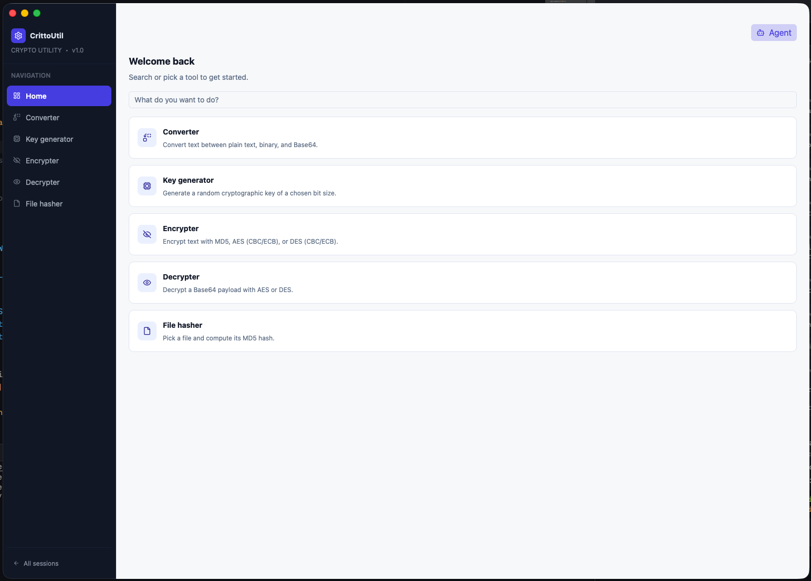
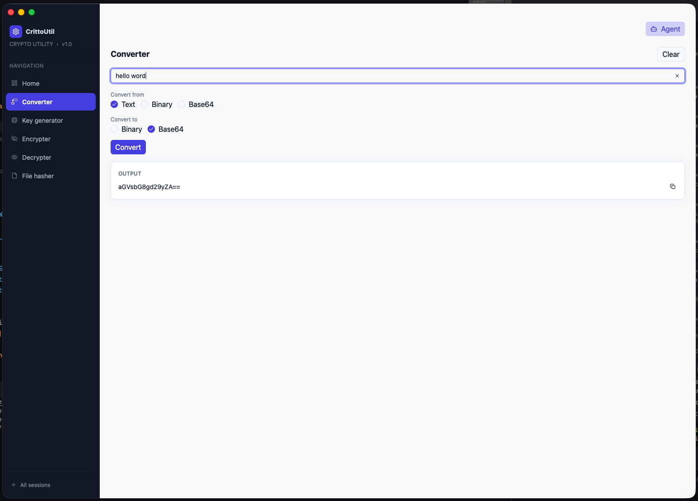
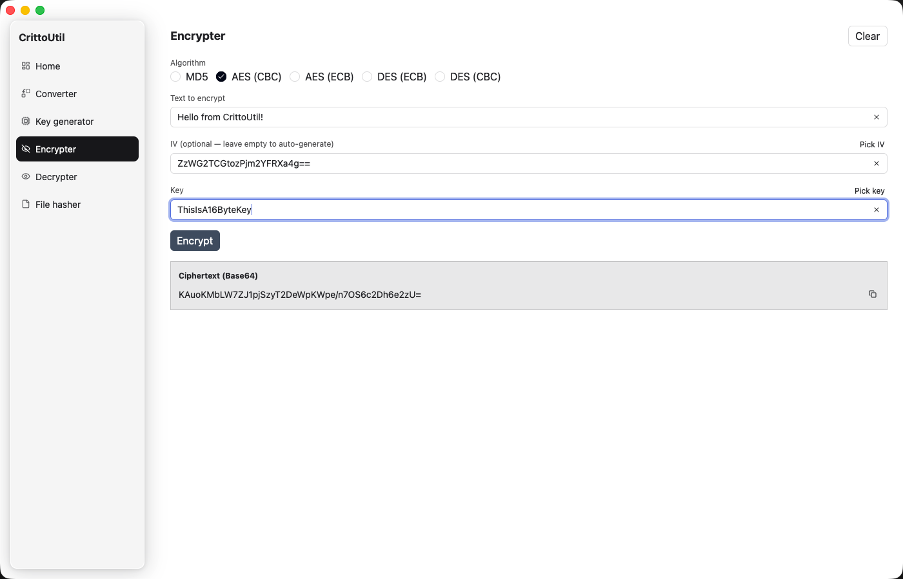
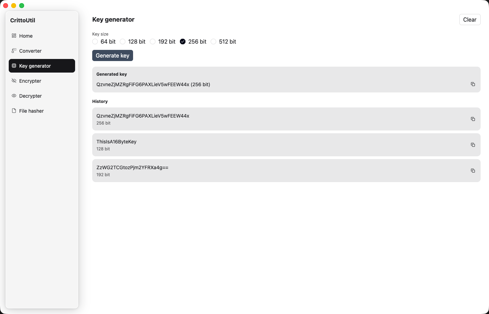

# gpui-crittoutil

A native desktop crypto utility for macOS, built with [gpui](https://github.com/zed-industries/zed)
and [gpui-component](https://github.com/longbridge/gpui-component) — the same UI toolkit used by
the [Zed](https://zed.dev) editor. It's a functional port of `tauri-crittoutil` (Tauri + Vue): same
features, same validation rules, but native Rust UI instead of a webview.

<p align="center">
  
  
</p>
<p align="center">
  
  
</p>

## Features

### Sessions

The app opens on a session picker: start a **new session** or resume one from the **recent
sessions** list. A session is just its key/IV history — persisted to disk
(`~/Library/Application Support/gpui-crittoutil/sessions.json`) so it survives restarts. "All
sessions" at the bottom of the sidebar returns to the picker.

### Six screens, navigated from the left sidebar

- **Home** — free-text search that scores against per-feature keywords and jumps you to the
  right screen.
- **Converter** — convert text between plain text, binary, and Base64.
- **Key Generator** — generate a random alphanumeric key at a chosen bit size (64–512 bit), with
  a running history you can copy from or reuse.
- **Encrypter** — encrypt text with MD5, AES (CBC/ECB), or DES (CBC/ECB). Leave the IV blank to
  auto-generate one; it's written back into the field so you always know what was actually used.
- **Decrypter** — decrypt a Base64 payload with AES or DES, with the same key/IV validation rules
  as the original app (byte-length checks, Base64-vs-plain-text IV heuristics).
- **File Hasher** — pick a file with the native file dialog and compute its MD5 hash.

Any key or IV you've generated or used is remembered in the session's shared history, pickable
from a dialog on the relevant fields.

### Agentic mode

Click the bot icon in the sidebar header to open a chat panel that talks to a **local LM Studio**
server (`http://localhost:1234/v1` by default — no data leaves your machine). The agent can call
the app's own `generate_key`, `encrypt`, `decrypt`, and `convert` tools on your behalf, e.g.
"generate a 256-bit key and use it to AES-encrypt this text" or "convert this to Base64". Any
key/IV it uses is added to the session's
history like anything you'd generate by hand.

## Getting started

### Requirements

- Rust (stable, edition 2024)
- macOS (the app has only been built/tested there; `gpui`/`gpui-component` also target Linux and
  Windows, but this project hasn't been verified on those platforms)

### Run

```sh
cargo run
```

### Test

```sh
cargo test
```

Tests cover `crypto.rs` (encryption/hashing/key generation, including edge cases like wrong key
length and wrong-key decryption failure), `converter.rs`, and `home_search.rs` — they're a
regression suite for functional parity with the original Tauri app.

### Agentic mode setup

1. Install [LM Studio](https://lmstudio.ai/), download any small/fast local model, and start its
   local server (default `http://localhost:1234`).
2. Open the app, click the bot icon in the sidebar, and start chatting.

## Tech stack

- [gpui](https://github.com/zed-industries/zed) — the GPU-accelerated UI framework behind Zed
- [gpui-component](https://github.com/longbridge/gpui-component) — the component library built on
  top of gpui (buttons, inputs, dialogs, sidebar, theming, …)
- `aes`, `des`, `cbc`, `ecb`, `cipher` — block cipher primitives
- `md5`, `base64`, `rand` — hashing, encoding, and key generation
- `serde`/`serde_json`, `dirs` — session persistence
- `ureq` — the local LM Studio HTTP client for agentic mode

## Project structure

See [CLAUDE.md](CLAUDE.md) for a detailed breakdown of the code layout, UI architecture
decisions, and house rules for contributing.
